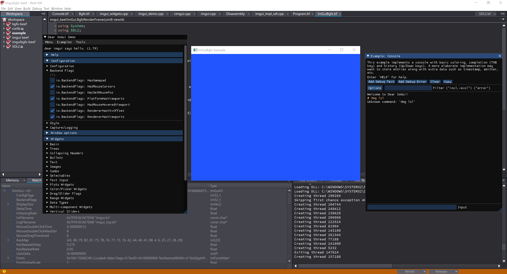

# [imguibgfx-beef](https://github.com/jazzbre/imguibgfx-beef) ImGui wrapper (with built-in Bgfx/SDL2 support) for the Beef Programming Language

[Dear ImGui](https://github.com/ocornut/imgui)

## Dependencies
[cimgui](https://github.com/cimgui/cimgui)
[ImGui-Beef](https://github.com/qzole/imgui-beef)

To build C/C++ API it needs the following parallel structure:
```
Root-Directory\
    |__ imguibgfx-beef\
    |__ bgfx-beef\
    |__ SDL2\
```

## Prerequisites
- To initialize submodules run *git submodule update --init --recursive*

## Windows
- Visual Studio 2019 Community/Professional (it can be built with other versions though, check build_windows_vs2019.cmd for more information)
- To build prerequisites run *build_windows_vs2019.cmd*

## MacOS
- To build prerequisites run *./build_macos.sh*

## Linux
- To build prerequisites run *./build_linux.sh*


## Usage

Open workspace and set Example as Startup project and Run!



## Future work
iOS and Android build scripts.
